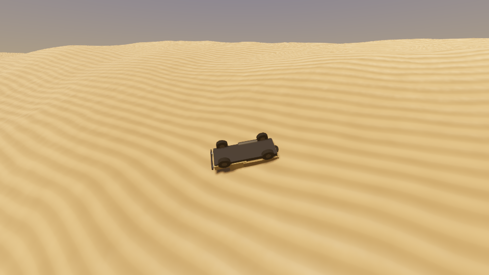
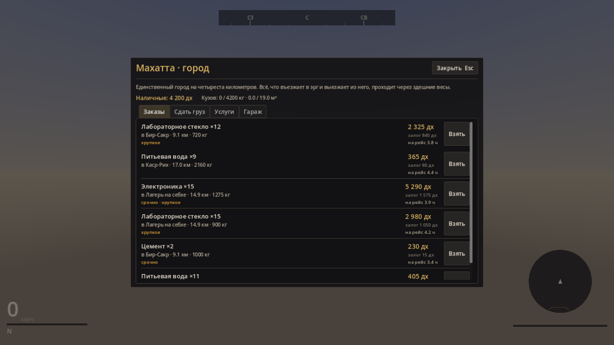

# Хамсин

Курьерский симулятор в аравийской пустыне. Карта двадцать на двадцать
километров, честная физика внедорожника, груз, который бьётся о каждую кочку,
и сюжет, который начинается с чужого долга.

Движок — Godot 4.5.1, основная платформа — macOS (Metal). Собирается и
запускается также на Linux и Windows.


<p align="center">
  
  
</p>

## Запуск на macOS

Нужен macOS 11 и новее на Apple Silicon или 10.15 на Intel, и примерно
гигабайт свободного места вместе с движком.

**1. Поставить Godot 4.5.1.** Скачать [Godot 4.5.1 Standard для
macOS](https://godotengine.org/download/macos/), распаковать, перетащить
`Godot.app` в «Программы». Первый запуск система заблокирует как приложение
без подписи: снять карантин один раз.

```bash
xattr -dr com.apple.quarantine /Applications/Godot.app
```

Дальше удобно завести короткую команду — все примеры ниже её используют.

```bash
sudo ln -sf /Applications/Godot.app/Contents/MacOS/Godot /usr/local/bin/godot
godot --version          # должно быть 4.5.1.stable
```

**2. Взять код.**

```bash
git clone https://github.com/NeoBlau/Khamsin.git
cd khamsin
```

**3. Запустить.**

```bash
tools/run.sh
```

Первый запуск дольше остальных: скрипт видит, что каталога `.godot` нет, и
прогоняет импорт ресурсов — минута-две. Дальше — главное меню, «Новый рейс», и
через пару секунд вы стоите в Махатте. Следующие запуски начинаются сразу.

Открыть в редакторе, чтобы смотреть и править:

```bash
tools/run.sh --editor
```

Скрипт — не украшение. Голый `godot --path .` на свежем клоне не работает: без
каталога `.godot` нет кеша глобальных классов, типы, объявленные через
`class_name`, движку неизвестны, автолоады не компилируются, и игра уходит в
поток ошибок `Invalid access to property or key on a base object of type 'Nil'`.
Само это не лечится — повторный запуск даст то же самое. Лечится импортом:

```bash
godot --headless --path . --import    # то, что tools/run.sh делает за вас
```

### Собрать .app

```bash
tools/build.sh macOS
```

Скрипт проверяет версию движка, импортирует ресурсы, прогоняет тесты и кладёт
универсальный бинарник (Intel + Apple Silicon) в `build/Khamsin.app`, около
180 мегабайт. Шаблоны экспорта нужны один раз: Godot ставит их сам через
Editor → Manage Export Templates → Download, а если их нет, скрипт скажет, куда
положить.

Собранное приложение тоже придётся выпустить из карантина:

```bash
xattr -dr com.apple.quarantine build/Khamsin.app
open build/Khamsin.app
```

### Если тормозит

Настройки меняются в игре, Esc → Настройки:

- масштаб отрисовки 0.75 — самое дешёвое, что можно сделать;
- тени «низкие» или «выкл»;
- поле зрения поменьше — в кадр попадает меньше ландшафта.

На M1 и новее в полном разрешении всё идёт без этого. Тяжелее всего первые
секунды после старта: собирается ближнее кольцо ландшафта.

### Тесты

```bash
tools/test.sh              # все, около десяти секунд
tools/test.sh --filter tire
```

## Управление

### За рулём

| Действие | Клавиши |
| --- | --- |
| Газ, тормоз, руль | W, S, A, D |
| Ручник | Пробел |
| Сцепление (в ручном режиме) | Shift |
| Передачи | E вверх, Q вниз |
| Полный привод | V |
| Блокировки дифференциалов | G |
| Пониженная передача | T (только на месте) |
| Давление в шинах | `[` и `]` |
| Радио | P — включить, `,` и `.` — станции |
| Фары | L |
| Камера (снаружи, из кабины, с капота, облёт) | C |
| Выйти из машины | X (только на стоянке) |
| Карта, журнал | M, J |
| Взаимодействие | F или Enter |
| Эвакуатор | R |
| Пауза | Esc |

### Пешком

| Действие | Клавиши |
| --- | --- |
| Идти | W, S, A, D |
| Бегом | Shift |
| Прыжок | Пробел |
| Осмотреться | мышь |
| Войти, сесть в машину, поговорить | F |
| Сесть обратно за руль | X |

Подсказка над прицелом всегда говорит, что именно сделает F: она спрашивает
ту же функцию, что и сама клавиша, и разойтись им негде.

### Геймпад

Работает любой, который видит система: Xbox, DualShock, DualSense, восьмибитный
китайский. Подписи ниже — по Xbox, на остальных читайте по расположению.

| Действие | Кнопка |
| --- | --- |
| Руль | левый стик |
| Газ, тормоз | правый и левый курки |
| Осмотреться | правый стик |
| Ручник | A |
| Сцепление | X |
| Передачи | RB вверх, LB вниз |
| Полный привод | нажать левый стик |
| Пониженная передача | крестовина вниз |
| Давление в шинах | крестовина влево и вправо |
| Сигнал | крестовина вверх |
| Камера | нажать правый стик |
| Взаимодействие | B |
| Выйти из машины | Y |
| Пауза | Start |

Действий в игре больше, чем кнопок на геймпаде, поэтому **Back работает
модификатором**: сам по себе он не делает ничего, а с ним те же кнопки дают
второй слой.

| Действие | Back + |
| --- | --- |
| Блокировки дифференциалов | A |
| Радио включить и выключить | B |
| Фары | X |
| Журнал | Y |
| Карта | крестовина вверх |
| Эвакуатор | крестовина вниз |
| Станция назад и вперёд | крестовина влево и вправо |

Пешком раскладка та же, где имеет смысл: левый стик — идти, нажать левый стик —
бегом, A — прыжок, B — войти, поговорить, поднять.

## Что это за игра

Вы получили в наследство грузовик и двадцать две тысячи долга. Долг гасится
рейсами: берёте груз на бирже, довозите до другого посёлка, получаете деньги
минус штрафы за опоздание и за то, что довезли не целиком.

Интересное начинается там, где заканчивается накатка. По песку машина едет
вдвое медленнее и жрёт вдвое больше. Спущенные до полутора бар колёса
увеличивают пятно контакта вдвое, машина перестаёт закапываться — но на камне
такая резина греется и стирается. Ползание по дюнам на первой передаче греет
двигатель, а перегретый двигатель теряет треть мощности. Хрупкий груз считает
каждый удар. Песчаная буря отбирает видимость и сдувает пустой кузов с курса.

Ни одна из этих механик не является числом в таблице: всё это следствия одной
физической модели.

Сюжет идёт пятью главами. Начинается он с чужого долга, а дальше в него
приходит Дядя Валя Вилсаком — человек, который держит в оазисе воду, мойку и
собственную радиостанцию, а технику, по его словам, больше не ищет: она
приезжает к нему сама, из ангара на сорок втором километре. Заканчивается всё
маршруткой, тремя молчаливыми пассажирами и маршрутом, которого нет на карте.
Маршрутка выдана намеренно неподходящей для песка, и это не шутка в диалоге, а
цифры в её конфиге.

## Как устроено

```
khamsin/
  project.godot        Godot 4.5, Forward+, Metal на macOS, физика 120 Гц, Jolt
  src/core/            автолоады: конфиг, случайность, шина событий, сейвы,
                       настройки, состояние прохождения, телеметрия, экраны
  src/audio/           синтез звука, лады, музыка, голос, радио, звук машины
  src/vehicle/         шина, подвеска, трансмиссия, кузов, кабина, камера, грязь
  src/player/          игрок на ногах
  src/world/           рельеф, дороги, чанки, погода, посёлки, здания, верблюды,
                       находки, сцена мира
  src/gameplay/        грузы, контракты, экономика, улучшения, дома и гаражи
  src/story/           условия, последствия, диалоги, главы
  src/ui/              оформление, приборы, экраны, обложка
  data/                машины, грузы, посёлки, дома, улучшения, радио, сюжет,
                       находки — всё в JSON
  shaders/             песок и небо
  tests/               215 тестов, свой раннер без внешних зависимостей
  tools/               запуск, тесты, стенд телеметрии, снимки экрана и
                       интерфейса, сборка
```

### Звук

Ни одного звукового файла: всё синтезируется в коде, как и геометрия.

Двигатель считается от частоты вспышек — для шестицилиндрового четырёхтактника
это `об/мин / 60 × 3` герц. Петли синтезируются один раз на опорной частоте и
тянутся `pitch_scale`, поэтому звук идёт непрерывно от холостых до отсечки, без
слышимых ступенек между семплами.

Радио — шесть станций, и эфир у каждой собирается на лету: лад, ритм, темп и
ведущий берутся из правил станции, а не из списка файлов. Музыка строится на
арабских ладах с четвертитоновыми ступенями (без них раст — обычный мажор, а
баяти — фригийский лад), ритм ведёт дарбука, мелодия ходит шагами с тяготением
к опорным ступеням. Приём зависит от расстояния до передатчика: пиратскую
волну слышно только ночью и только в семи километрах от её сарая.

Голос — формантный синтез. Гласную ухо опознаёт по двум-трём резонансам
тракта; берём импульсы связок и гоним их через полосовые фильтры. Ритм и
интонация приходят из самого текста реплики: запятая даёт паузу,
вопросительный знак ведёт тон вверх. Настоящей озвучки записать я не могу, и
это честная замена, а не заглушка: у персонажа без прописанного профиля голос
выводится из имени и остаётся тем же между разговорами.

### Пешком

Из машины можно выйти — на стоянке, клавишей X. Пешая часть не отдельная игра,
а способ дотянуться до того, до чего из кабины не дотянуться: зайти в дом,
подойти к верблюду ближе, чем стоило бы, отмыть плевок. Рыхлый песок держит
ногу так же, как колесо, и коэффициент берётся из того же справочника
покрытий — своего у пешехода нет и быть не должно.

### Посёлки

Посёлок — не круг в песке, а улица с домами, в которые можно зайти. Состав
зданий следует из услуг буквально: заправку строит наличие `fuel`, мастерскую —
`repair`, почту — `post`. Мастерской, которой нет в услугах, не будет и на
улице.

Дома строятся изнутри наружу — сначала комнаты, потом стены вокруг них, — и
дверные проёмы получаются не вырезанием дыры, а тем, что стена собрана из
кусков. Дороже в коде, зато геометрия остаётся выпуклой, и в дверь можно
пройти, не цепляясь за косяк.

Сборка идёт очередью шагов с бюджетом четыре миллисекунды на кадр: оазис — это
почти тысяча двести мешей, и собранный за один кадр он даёт просадку на двести
миллисекунд ровно в тот момент, когда в него въезжаешь.

### Дома и гаражи

Пять домов, которые открываются по сюжету или покупаются. Гараж — не
украшение: пока вторую машину негде держать, покупать её незачем. Что стоит в
гараже, живёт в прохождении, а не в сцене, поэтому гараж в Айн-Дибе помнит
свою машину, пока вы в Хуфре.

### Верблюды, грязь и мойка

Верблюды пасутся у поселений и вдоль дорог. Пока вы далеко — им всё равно;
проедете близко и быстро — поднимут голову, а потом плюнут. Плевок летит по
дуге с упреждением, прилипает к кузову снаружи и портит обзор через стекло.

Пыль копится от пройденного пути и от бури, на стекле быстрее, чем на бортах, и
смывается водой в любом посёлке. Верблюжий плевок — нигде, кроме оазиса Дяди
Вали: слюна густая и въедается в краску, а щётки есть только там. Всё это
живёт в сейве, так что приехать на мойку — это задача, а не кнопка в меню.

### Находки

Десять мест в эрге, где стоит что-то, чего там быть не должно: шезлонг с
запиской «занято» в сорока километрах от жилья, работающая телефонная будка,
маршрутка по стёкла в песке с маршрутом «17 — Квадрат 17 — 17», тёплый чайник
и три налитых стакана без единого следа вокруг.

Они не отмечены на карте и не выдаются заданием. Единственный способ их найти
— свернуть с маршрута, и поэтому они расставлены руками, а не сгенерированы.

### Физика

Шина считается по нормированной формуле Пацейки с комбинированным
скольжением: продольная и боковая силы делят один и тот же запас сцепления
через эллипс трения — отсюда и то, что газ в повороте съедает поворот.
Сингулярности на нулевой скорости нет: скольжение фильтруется длиной
релаксации каркаса, как в реальной шине.

Пятно контакта берётся из простого и честного соотношения: воздух в шине
держит нагрузку, значит площадь равна нагрузке, делённой на давление. Отсюда
следует всё остальное — просадка в грунт по закону «давление — просадка»,
сопротивление сгребанию песка и выигрыш от спуска колёс.

Подвеска — пружина с раздельными ходами сжатия и отбоя, отбойником в конце
хода и стабилизаторами поперечной устойчивости. Двигатель — кривая момента с
регулятором холостых, отсечкой, нагревом и расходом по удельному расходу
топлива. Дальше сцепление с проскальзыванием, коробка (автомат и ручной
режим), раздатка и дифференциалы, свободные или блокируемые.

Вращение колёс интегрируется подшагами внутри кадра физики: без этого
буксующее колесо на 120 Гц теряет устойчивость.

Резина греется от проскальзывания и теряет сцепление и на холодной, и на
перегретой: оптимум около восьмидесяти градусов. Развал считается от хода
подвески и зеркален по бортам, иначе тяга от развала сносит машину на прямой.

Боковая сила приложена позади оси колеса, а не в центре пятна, — отсюда
стабилизирующий момент, который возвращает машину на курс сам. Пневматический
след схлопывается раньше, чем кончается сцепление: это единственное
предупреждение, которое передняя ось даёт до срыва.

Тормоза греются и выцветают. Спуск с высокой дюны на одних тормозах кончается
тем, что их не остаётся; для этого в коробке и есть пониженная.

Горячий воздух реже холодного, и атмосферный мотор теряет вместе с ним. В
полдень при сорока пяти градусах это около восьми процентов момента — на
подъёме с грузом слышно раньше, чем видно на спидометре.

### Песок, который помнит

Рельеф — чистая функция от координат, и следов он не держит по построению.
Поэтому поверх него лежит разреженная сетка поправок с шагом полметра: где
продавлено, сколько выдавило в бруствер по краям, насколько песок взрыхлён.

Это не косметика поверх физики, а физика:

* точка контакта опускается на поправку, и машина проваливается в собственный
  след — для подвески это неотличимо от настоящей ямы;
* взрыхлённый песок глубже проседает под колесом, так что второй проход по
  своей же колее тяжелее первого;
* взрыхлённый песок хуже держит: буксуя на месте, колесо роет себе яму и
  теряет сцепление, а не гребёт вечно с одной и той же тягой;
* материал не исчезает. Что продавили, то выдавило по краям, и бруствер мешает
  выехать из глубокой колеи вбок;
* колею роет только работающее колесо — катящееся по новому месту или
  срезающее грунт буксованием. Стоящее не роет ничего: его просадка уже
  посчитана в модели шины, и писать её ещё и в грунт значит считать одно и то
  же дважды;
* бруствер ложится вбок и назад, но никогда вперёд. Колесо гонит песок в
  стороны и себе под зад, а не насыпает вал на дороге, по которой ему сейчас
  ехать.

Колея не вечная. Она осыпается по углу естественного откоса — тридцать четыре
градуса для сухого песка, — засыпается ветром тем быстрее, чем сильнее ветер,
и в бурю исчезает на глазах. Плитки дальше двухсот шестидесяти метров от
игрока выгружаются: пустыня забывает следы, и это не уступка
производительности, а то, как оно и есть.

В колею записывается не вся просадка колеса, а её пластическая доля, и не
мгновенная, а отфильтрованная по времени. Обе поправки — не подгонка:

* без пластической доли выходит петля с усилением — колея глубже, опора ниже,
  колесо проседает сильнее, — и машина уходит в песок по мосты, стоя на месте;
* без фильтра по времени удар при приземлении штампует яму предельной глубины
  за миллисекунды, два колеса повисают в воздухе, и дальше машина не едет.
  Пластическая деформация идёт за длительной нагрузкой, а не за пиком.

Обе ошибки в этом коде были, обе закрыты тестами, и обе снаружи выглядели
совершенно одинаково: «машина почему-то не разгоняется».

Чего тут нет и не будет: симуляции отдельных песчинок. Ни здесь, ни в играх,
на которые принято ссылаться, каждая песчинка в кадре не живёт. Симулируется
то, что игрок чувствует рулём: продавливание, осыпание и рыхлость.

### Мир

Рельеф — чистая функция координат. Одну и ту же функцию зовут генератор меша,
генератор коллизии, построитель маршрутов и запрос «что под колесом», поэтому
картинка, физика и грунт заведомо описывают одну землю.

Дюны собраны из асимметричного профиля: длинный пологий наветренный склон и
короткий крутой подветренный, до тридцати трёх градусов — угла естественного
откоса песка. Вверх заезжаешь, вниз падаешь.

Дороги никто не рисовал. Они прокладываются поиском пути по стоимости, где
дорого лезть в склон и дорого идти по рыхлому песку, а потом выравнивают под
собой землю и меняют покрытие на накатку.

Мир целиком выводится из сида: сохранение хранит число, а не миллион вершин.
Одинаковый сид даёт одинаковую пустыню на любой машине.

### Данные

Машины, грузы, посёлки, улучшения, главы и диалоги лежат в `data/` обычным
JSON. В коде машины нет ни одного магического числа: балансировать её
пересборкой было бы издевательством. Условия и последствия в сюжете — это
фиксированный набор ключей, а не язык внутри JSON: опечатка ругается вслух, а
не молча не срабатывает.

## Проверка

```bash
tools/test.sh                 # всё
tools/test.sh --filter tire   # только шина
```

Тесты не полагаются ни на один внешний плагин. Юнит-тесты проверяют формулы,
интеграционные — настоящую физику: осадку на подвеске, распределение веса,
тормозной путь, разницу песка и хамады, заезды по сгенерированным дюнам.
Отдельно проверяется связность данных — что диалоги не ведут в несуществующие
узлы, а биты сюжета не ждут посёлков, которых нет на карте.

Три бага, которые нашлись только глазами и теперь закрыты тестами: обратный
порядок обхода треугольников (движок молча переставал рисовать ландшафт),
`return` внутри fragment-шейдера (шейдер не собирается, поверхность исчезает) и
потеря точности процедурного шума на координатах в тысячи метров.

И один — в самом раннере, из-за которого всё вышеперечисленное долго выглядело
зелёным. Godot возвращает для теста с `await` не `Signal`, а объект
`GDScriptFunctionState` с сигналом `completed`. Раннер проверял только первое,
не находил, шёл дальше не дождавшись теста и засчитывал его пройденным.
Асинхронными у нас были все интеграционные тесты — физика машины, езда по
дюнам, потоковая подгрузка, экраны. Когда они наконец пошли, нашлось четыре
настоящих бага, включая инвертированный руль: жмёшь вправо — машина уходит
влево.

Мораль простая и дорого купленная: зелёный набор тестов сам по себе ничего не
доказывает, пока не видно, что в нём выполнилось. Число проверок в отчёте —
не украшение, а единственное, по чему это заметно.

## Замеры

Числа получены стендом, а не выдуманы для описания. Воспроизводятся командой
из следующего раздела.

Разгон и максимальная скорость, машина без груза:

| Покрытие | 0-30 км/ч | 0-60 км/ч | Максимум |
| --- | --- | --- | --- |
| Асфальт | 2.8 с | 7.7 с | 114 км/ч |
| Накатка | 2.8 с | 8.1 с | 108 км/ч |
| Хамада | 3.0 с | 8.9 с | 100 км/ч |
| Плотный песок | 4.0 с | 12.8 с | 74 км/ч |
| Рыхлый песок | 8.8 с | — | 34 км/ч |

Тормозной путь с шестидесяти:

| Покрытие | Путь | Замедление |
| --- | --- | --- |
| Асфальт | 18.3 м | 0.77 g |
| Накатка | 19.5 м | 0.73 g |
| Хамада | 21.5 м | 0.66 g |
| Плотный песок | 24.5 м | 0.58 g |

Давление в шинах на рыхлом песке — двадцать секунд полного газа с места:

| Давление | Пройдено | Скорость | Просадка колеса |
| --- | --- | --- | --- |
| 2.8 бар | 92 м | 29 км/ч | 38 см |
| 2.4 бар | 92 м | 29 км/ч | 38 см |
| 1.8 бар | 136 м | 35 км/ч | 30 см |
| 1.4 бар | 163 м | 40 км/ч | 24 см |
| 1.0 бар | 193 м | 50 км/ч | 18 см |

Предельный подъём с места, на пониженной и с блокировками, шины 1.6 бар:

| Покрытие | Берёт |
| --- | --- |
| Хамада | до 15° |
| Плотный песок | до 15° |
| Рыхлый песок | не берёт и десять |

Последняя строка — не недоработка, а следствие модели: тронуться с места на
рыхлом склоне нельзя, туда заезжают с разгона. Пятнадцать градусов для
гружёного шеститонника на щебне — по нижней границе правдоподобного, и это
известное место, куда стоит вернуться при следующей настройке машины.

Спуск колёс с 2.4 до 1.0 бар удваивает пройденное расстояние и поднимает
скорость с двадцати девяти до пятидесяти. Ни одно из этих чисел нигде не
задано: они выходят из того, что площадь пятна равна нагрузке, делённой на
давление, а просадка в песок — из давления в пятне.

## Инструменты

```bash
# стенд телеметрии: разгон, тормозной путь, влияние давления, предельный уклон
godot --headless --path . res://tools/bench_vehicle.tscn

# одна секция вместо всех: полный прогон занимает четверть часа
godot --headless --path . res://tools/bench_vehicle.tscn -- --only gradient

# снимок мира в PNG без запуска игры руками
godot --path . --rendering-driver vulkan --resolution 1280x720 \
  res://tools/screenshot.tscn -- --out /tmp/shot.png --hour 8.5 --drive 6
```

Стенд ничего не утверждает — он измеряет. Пороговые проверки живут в тестах, а
сюда ходят, когда поменяли настройки машины и хотят понять, что изменилось.

## Сборка под macOS

```bash
tools/build.sh macOS
```

Скрипт проверяет версию движка, импортирует ресурсы, прогоняет тесты и
собирает универсальный бинарник в `build/`. Шаблоны экспорта Godot ставит сам
при первом запуске редактора; в консольной сборке скрипт скажет, куда их
положить.

Свежесобранное приложение macOS карантинит:

```bash
xattr -dr com.apple.quarantine build/Khamsin.app
```

Для распространения нужны подпись и нотаризация — параметры лежат в
`export_presets.cfg`.

## Чего здесь нет

Честный список, чтобы не было сюрпризов.

- **Художественных ассетов.** Вся геометрия процедурная или собрана из
  примитивов, текстур нет вообще: песок и небо считаются в шейдере. Силуэт
  грузовика узнаваем, но это силуэт.
- **Звука.** Шины аудио готовы (шина событий, громкости, разделение по
  каналам), самих звуков нет.
- **Контента.** Девять посёлков, десять типов груза, восемь улучшений, одна
  глава сюжета целиком и начало второй. Это вертикальный срез: цикл замкнут от
  меню до сдачи груза, но играть в него неделю нечем.
- **Мультиплеера и консолей.**

Что из этого доделывается контентом, а что требует новых систем, видно по
структуре: добавить посёлок — это строчка в JSON, добавить погоду со снегом —
это новая система.

## Лицензия

Код проекта. Внешних ассетов нет, поэтому и чужих лицензий тоже.
